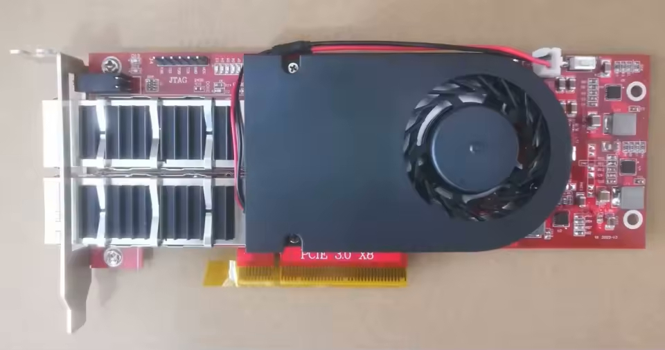
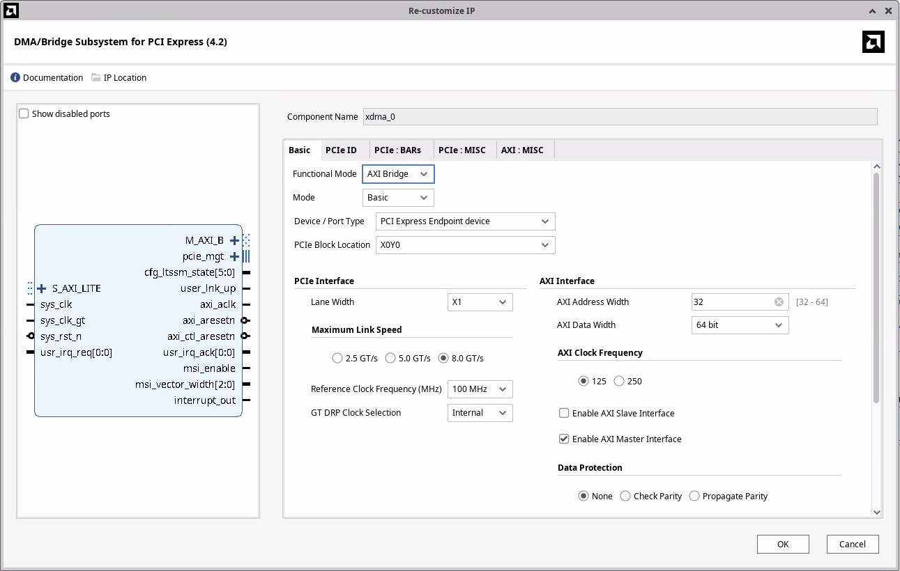
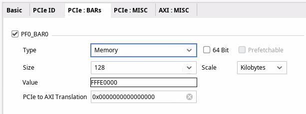
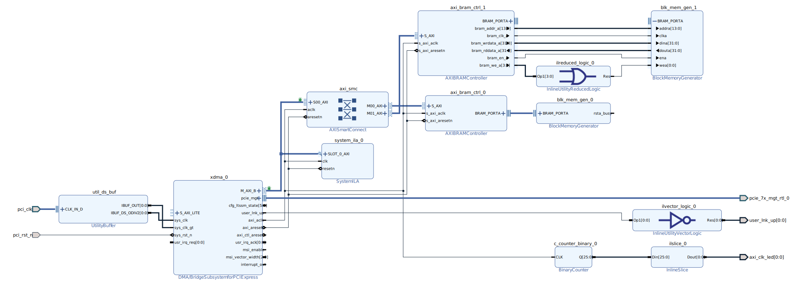

PCIe on Ultrascale+ FPGA: Hello World
=====================================

A while ago I procured this Xilinx KU5P board from [Aliexpress](https://www.aliexpress.com/item/4001302554837.html)



It's pretty barren, with a few LEDs, 2x QSFP+ ports, PCIe 3 x8 interface, and a mandatory SPI chip. Having an on-board
DDR would be nice, but considering it costs only £150 I'm not going to be too picky.

# Hardware

I watched [FPGAZealot's YouTube video](https://www.youtube.com/watch?v=m56rBYnmxME) where he's using the
[XDMA IP (PG195)](https://docs.amd.com/r/en-US/pg195-pcie-dma/Introduction) to interface with his FPGA. It looked like
XDMA is ais a very simple and performant way to talk to the FPGA from a host over PCIe. However, I don't like that
to use XDMA I need to compile and load a [custom driver](https://github.com/Xilinx/dma_ip_drivers/tree/master). For my
first PCIe project I wanted to keep things as simple as possible. Both on the FPGA side and software.

I discovered that the XDMA IP can work in
[AXI Bridge Mode (PG194)](https://docs.amd.com/r/en-US/pg194-axi-bridge-pcie-gen3/Introduction) as well!



With this configuration the IP will translate reads and writes to BAR0 of the PCIe device as AXI4 reads and writes.



This should make writing software really simple, or so I thought.

## Architecture

The block diagram contains two BRAM memories accessible via the AXI network, an LED to indicate whether the link is up,
and an LED to indicate whether we have clock on the AXI bus.



## AXI memory map

- 0x0000 .. 0x3FFF (16k) - `blk_mem_gen_0` (only 4k backed by BRAM)
- 0x4000 .. 0x7FFF (16k) - `blk_mem_gen_1` (only 4k backed by BRAM)

The two BRAMs are wired slightly differently. If I configure the Block Memory Generator as a BRAM Controller, which is
designed to work with AXI BRAM Controller, I cannot initialize the block ram from a coefficient file. So I want to try
to wire the AXI BRAM Controller directly to a BRAM, and see if that will work[^1].

# Connecting the FPGA to a computer

Now that the hardware is done, I need to connect it to a computer. The standard way is to plug it into a spare PCIe slot
on a desktop computer, or lately to a SBC like a Raspberry Pi 5 that has a PCIe slot.

Unfortunately, I do not have such an SBC or a spare computer that I'd be willing to let running the whole time.

Another downside of this approach is that every time I change the size of the PCIe BARs (which I didn't know how often I
would do) I would need to restart the computer. Which might reset the FPGA. Without the correct bitstream loaded, the
FPGA will not show up as a PCIe device. That means I would need to program the on-board flash. If possible I'd like to
avoid both of these steps.

## Thunderbolt to the rescue

My laptop is running linux, and it has two USB 4 ports that support Thunderbolt. And Thunderbolt can provide external
access to the PCIe bus. Using a [cheap Thunderbolt 4 NVMe enclosure](https://fideco-it.com/products/fideco-usb-4-40gbps-type-c-nvme-enclosure-with-cooling-fan-mt402)
and an [NVMe to PCIe adapter](https://www.amazon.co.uk/dp/B0CTT7JQ5D) I was able to connect the FPGA to my laptop.

[//]: # (TODO: Add an image of my real setup)

One benefit of this approach is that if I do make changes to the BARs, I don't need to reboot my computert. I can just
unplug and plug in the external NVMe enclosure.

After plugging in the USB-C cable, I see the clock LED flashing, link up LED is lit, and my device has showed up!

```bash
$ lspci
20:00.0 PCI bridge: ASMedia Technology Inc. Device 2463
21:00.0 PCI bridge: ASMedia Technology Inc. Device 2463
22:00.0 Serial controller: Xilinx Corporation Device 9031

$ sudo lspci -s 22:00.0 -vnn
22:00.0 Serial controller [0700]: Xilinx Corporation Device [10ee:9031] (prog-if 01 [16450])
        Subsystem: Xilinx Corporation Device [10ee:0007]
        Flags: fast devsel, IRQ 16, IOMMU group 16
        Memory at b0000000 (32-bit, non-prefetchable) [size=128K]
        Capabilities: [40] Power Management version 3
        Capabilities: [48] MSI: Enable- Count=1/1 Maskable- 64bit+
        Capabilities: [70] Express Endpoint, MSI 00
        Capabilities: [100] Advanced Error Reporting
        Capabilities: [1c0] Secondary PCI Express

$ lspci -s 22:00.0 -vnnt
-[0000:00]---07.0-[20-49]----00.0-[21-22]----00.0-[22]----00.0  Xilinx Corporation Device [10ee:9031]
```

An interesting observation is that the Thunderbolt connects the device through 2 PCI bridges. I wasn't expecting that.
Let's have a look at the two devices:

```bash
$ sudo lspci -s 20:00.0 -v
20:00.0 PCI bridge: ASMedia Technology Inc. Device 2463 (prog-if 00 [Normal decode])
        Subsystem: ASMedia Technology Inc. Device 2463
        Physical Slot: 3
        Flags: bus master, fast devsel, latency 0, IRQ 16, IOMMU group 15
        Bus: primary=20, secondary=21, subordinate=22, sec-latency=0
        I/O behind bridge: 3000-3fff [size=4K] [16-bit]
        Memory behind bridge: b0000000-bc1fffff [size=194M] [32-bit]
        Prefetchable memory behind bridge: 6000000000-601bffffff [size=448M] [32-bit]
        Capabilities: [50] MSI: Enable- Count=1/1 Maskable- 64bit+
        Capabilities: [70] Power Management version 3
        Capabilities: [80] Express Upstream Port, MSI 00
        Capabilities: [c0] Subsystem: ASMedia Technology Inc. Device 2463
        Capabilities: [100] Advanced Error Reporting
        Capabilities: [160] Latency Tolerance Reporting
        Capabilities: [1c0] Secondary PCI Express
        Capabilities: [200] L1 PM Substates
        Capabilities: [220] Data Link Feature <?>
        Capabilities: [240] Physical Layer 16.0 GT/s <?>
        Capabilities: [280] Lane Margining at the Receiver <?>
        Kernel driver in use: pcieport

$ sudo lspci -s 21:00.0 -v
21:00.0 PCI bridge: ASMedia Technology Inc. Device 2463 (prog-if 00 [Normal decode])
        Subsystem: ASMedia Technology Inc. Device 2463
        Flags: bus master, fast devsel, latency 0, IRQ 210, IOMMU group 16
        Bus: primary=21, secondary=22, subordinate=22, sec-latency=0
        I/O behind bridge: 3000-3fff [size=4K] [16-bit]
        Memory behind bridge: b0000000-bc1fffff [size=194M] [32-bit]
        Prefetchable memory behind bridge: 6000000000-601bffffff [size=448M] [32-bit]
        Capabilities: [50] MSI: Enable+ Count=1/1 Maskable- 64bit+
        Capabilities: [70] Power Management version 3
        Capabilities: [80] Express Downstream Port (Slot+), MSI 00
        Capabilities: [c0] Subsystem: ASMedia Technology Inc. Device 2463
        Capabilities: [100] Advanced Error Reporting
        Capabilities: [1c0] Secondary PCI Express
        Capabilities: [200] L1 PM Substates
        Capabilities: [220] Data Link Feature <?>
        Capabilities: [240] Physical Layer 16.0 GT/s <?>
        Capabilities: [280] Lane Margining at the Receiver <?>
        Kernel driver in use: pcieport
```

If you look at capability 0x80, you can see taht 20:00.0 is an upstream port, and 21:00.0 is a downstream port. Today
I learned that PCIe bridges (and possibly switches too?) will show up as multiple functions. One for the upstream port
that connects to the system and one for evey downstream port.

# Talking to the FPGA

Now that the FPGA is programmed and connected to my computer, let's talk to it.

## Reading BAR0

As a very first sanity check, let's read and write to BAR0. On linux that should be really simple because linux provides
a sysfs itnerface for PCI devices. If we look at the sysfs of the device, we see a file `resource0` which corresponds to
BAR0.

```bash
$ ll /sys/bus/pci/devices/0000:22:00.0/resource0
-rw------- 1 root root 128K Jul 19 13:23 /sys/bus/pci/devices/0000:22:00.0/resource0
```

It has the right size - we configured the BAR0 to be 128KiB. Let's read the first 64 bytes.

```bash
$ sudo hexdump -n 64 /sys/bus/pci/devices/0000:22:00.0/resource0
hexdump: /sys/bus/pci/devices/0000:22:00.0/resource0: Input/output error
```

Well... that's not what I was expecting. But after inspecting the the [`pci_create_attr`](https://elixir.bootlin.com/linux/v6.15.6/source/drivers/pci/pci-sysfs.c#L1193)
function that creates the `resource0` file we can see that read/write syscalls are implemetned only for BARs that are in
IO space.

No problem, let's throw together a small C program to open the and MMAP the first few bytes of BAR0:

```c
#include <stdio.h>
#include <fcntl.h>
#include <sys/mman.h>

int main(void) {
    int fd = open("/sys/bus/pci/devices/0000:22:00.0/resource0", O_RDONLY);
    if (fd < 0) {
        perror("open");
        return 1;
    }

    int *addr = (int*)mmap(NULL, 128, PROT_READ, MAP_SHARED, fd, 0);
    if (addr == MAP_FAILED) {
        perror("mmap");
        return 1;
    }

    printf("%x\n", addr[0]);
    return 0;
}
```

Let's compile and run this program as root

```bash
$ gcc bar0.c -o bar0
$ sudo ./bar0
mmap: Operation not permitted
```

And it still fails. I wansn't quite sure what was going on but I had 2 theories:
1. I'm running Ubuntu 24; perhaps AppArmor has rules that forbid mmaping PCIe BARs from userspace
1. Device is connected via Thudnerbolt and there might be extra security in place to prevent attacks from malicious
   Thunderbolt devices

It was simple enough to test whether AppArmor is the issue.

```
$ sudo systemctl stop apparmor

$ sudo ./bar0
mmap: Operation not permitted

$ sudo systemctl start apparmor
```

Likely not, then.

Could the issue be because of thunderbolt

After a bit of googling I discovered that the root cause is something completely different. A user in
[this reddit thread](https://www.reddit.com/r/linux_programming/comments/pg0yy2/strange_mmap_for_accessing_a_pci_bar_over_sysfs/)
had a similar issue. However, his kernel config had `CONFIG_IO_STRICT_DEVMEM` set, which mine doesn't.

```bash
$ grep DEVMEM /boot/config-6.8.0-63-generic
CONFIG_DEVMEM=y
CONFIG_ARCH_HAS_DEVMEM_IS_ALLOWED=y
CONFIG_STRICT_DEVMEM=y
# CONFIG_IO_STRICT_DEVMEM is not set
```

Solution to the redditor's problem was to add `iomem=relaxed` to the kernel command line. However, when I tried this I
still couldn't read the contents of BAR0. Another approach is to open `/dev/mem` and interact with the memory at the
offset of the BAR directly (in my case 0xb0000000) but because I have `CONFIG_DEVMEM` enabled, this didn't work either.

## VFIO crash course

VFIO (Virtual Function I/O) is a linux kernel framework that allows us to write device drivers in userspace. In this
project I use it only to read and write to the PCIe BAR, but the most useful features of VFIO are DMA and interrupt
remapping.

With DMA remapping I can create buffers in my application and VFIO configures the IOMMU to point certain device
virtual addresses to my buffers. With interrupt remapping we can use eventfds in our application.

More info on VFIO and how it works can be found at [docs.kernel.org](https://docs.kernel.org/driver-api/vfio.html).

Using VFIO is surprisingly simple.

### 0. Setup the device

Steps to bind the VFIO driver to a device are outlined in the kernel docs. To simplify my life, I let AI generate
a script that does this for me.

Either follow the instructions at [docs.kernel.org](https://docs.kernel.org/driver-api/vfio.html) or you can run

```bash
$ sudo python3 ./sw/ai-generated/setup_vfio.py 22:00.0
... lots of debug output ...

[INFO] VFIO setup completed successfully!

[INFO] Device Information:
==================================================
22:00.0 Serial controller: Xilinx Corporation Device 9031 (prog-if 01 [16450])
        Subsystem: Xilinx Corporation Device 0007
        Flags: fast devsel, IRQ 16, IOMMU group 16
        Memory at b0000000 (32-bit, non-prefetchable) [size=128K]
        Capabilities: [40] Power Management version 3
        Capabilities: [48] MSI: Enable- Count=1/1 Maskable- 64bit+
        Capabilities: [70] Express Endpoint, MSI 00
        Capabilities: [100] Advanced Error Reporting
        Capabilities: [1c0] Secondary PCI Express
        Kernel driver in use: vfio-pci

[INFO] VFIO Status:
==============================
Device Path: /sys/bus/pci/devices/0000:22:00.0
Driver: vfio-pci
IOMMU Group: 16
Vendor:Device ID: 10ee 9031

[INFO] Device is now ready for VFIO access!
```


### 1. Create a container

Think of a container as the ownership domain for a set of devices that will share the same I/O address space, managed by
the IOMMU. It's the fundamental unit of isolation in VFIO. When you create a container by opening `/dev/vfio/vfio`,
you're essentially asking the kernel to create a new, empty, and isolated memory "sandbox".

```c
int container_fd = open("/dev/vfio/vfio", O_RDWR);
```

### 2. Open the group

A group is a set of devices which is isolatable from all other devices in the system. Groups are therefore the unit of
ownership used by VFIO. On modern platforms, especially servers, each device in usually in its own IOMMU group.

You can figure out the IOMMU group of a PCI device either through lspci or via sysfs (the `iommu_group` file).

In my case the setup script prints that the FPGA is in IOMMU group 16. Opening the group is again one line of code.

```c
int group_fd = open("/dev/vfio/16", O_RDWR);
```

### 3. Set container for the group and enable IOMMU

```c
ioctl(group_fd, VFIO_GROUP_SET_CONTAINER, &container_fd);
ioctl(container_fd, VFIO_GROUP_SET_IOMMU, VFIO_TYPE1_IOMMU);
```

### 4. Get device file descriptor

```c
int device_fd = ioctl(group_fd, VFIO_GROUP_GET_DEVICE_FD, PCI_DEVICE_NAME);
```

### 5. mmap BAR0

```c
// Get device info.
struct vfio_device_info device_info = {.argsz = sizeof(device_info)};
ioctl(device_fd, VFIO_DEVICE_GET_INFO, &device_info);

// Get info about BAR0.
struct vfio_region_info bar0_info = {
        .index = 0,
        .argsz = sizeof(bar0_info)
};
ioctl(device_fd, VFIO_DEVICE_GET_REGION_INFO, &bar0_info);

// Map BAR0.
mapped_mem = mmap(NULL, MMAP_SIZE, PROT_READ | PROT_WRITE, MAP_SHARED, device_fd, bar0_info.offset);
```

# Benchmarking

Let's calculate the limits of what we can expect in terms of bandwidth.

I am connecting to my FPGA with 1 lane of PCIe 3.0. That has max theoretical bandwidth just below 1GB/s.

BRAM has 32 bit wide data bus. Read latency is 1 clock cycle. Let's assume that read and write latency are the same.
At AXI clock of 125MHz, this shold provide us with $125MHz * 4B/Hz = 500MB/s$ of bandwidth. About a half of what we
can saturate with one link of PCIe 3.0 but still plenty for this experiment.

Now lets tie everything together and write a simple benchmark to check how fast we can read and write.

## AI take the wheel

Recently my current employer started a trial of [Cursor](https://cursor.com) editor. I was curious what kind of code it
would generate if I asked it to create this benchmark. Would it work? Would it do something completely stupid? What if
I asked it to write the benchmark in Rust?

If you're curious about how that went down, have a look at the [./sw/ai-generated](./sw/ai-generated/) directory.
Everything in this directory was written by AI.

Overall, I have to say I'm pretty impressed. I found the AI agent to be the best at doing research. Is there a rust
crate with VFIO bindings? Which one is the best? If I have an issue, AI gave me a few options on what could be the
problem and I liked how I could iterate on it.

When it comes to coding, it needed a lot more hand holding. It's quite useful for creating scripts that I don't want to
do. For example, the [`setup_vfio.py`](./sw/ai-generated/setup_vfio.py) script was generated by AI and it works well
enough. A few prompts and the script was working good enough.

The rust benchmark needed a lot more prompts to get it to a state where it would work somewhat well. At first the AI
was calling `ioctl` directly in unsafe blocks. But when I prompted it to use a crate, it did some research on which
crate would be the best for the use case. And it seems like it got it right. AI was writing everything into one big file
so if you want your code to have some structure, you also need to specify that. And it's likely that you'll need to
outline what structure the code should have.

The end result was too verbose for my liking, after all we just want to write a few values to a memory location and
measure how long that takes. However, I am confident that with more prompting I could get it to the state where I'd be
happy with the code.

## Hand written benchmark in Rust

I looked at the code the AI wrote and I decided to write something a lot shorter that gives me exactly the data I want.
The result is the [vfio-benchmark](./sw/vfio-benchmark/) project. It uses the
[`read_bytes`](https://docs.rs/pci-driver/latest/pci_driver/regions/struct.OwningPciRegion.html#method.read_bytes) and
[`write_le_u32`](https://docs.rs/pci-driver/latest/pci_driver/regions/struct.OwningPciRegion.html#method.write_le_u32)
methods provided by the [pci-driver](https://crates.io/crates/pci-driver) crate.

And the results are... underwhelming
```bash
$ sudo ./target/release/vfio-benchmark
Starting the benchmark...
Read size:    8 bytes, Mean: 1.519 MiB/s, Min: 1.593 MiB/s, Max: 0.056 MiB/s
Read size:   64 bytes, Mean: 1.575 MiB/s, Min: 1.619 MiB/s, Max: 0.297 MiB/s
Read size:  128 bytes, Mean: 1.604 MiB/s, Min: 1.622 MiB/s, Max: 0.467 MiB/s
Read size:  512 bytes, Mean: 1.603 MiB/s, Min: 1.621 MiB/s, Max: 0.643 MiB/s
Read size: 1024 bytes, Mean: 1.607 MiB/s, Min: 1.622 MiB/s, Max: 0.668 MiB/s
Read size: 4096 bytes, Mean: 1.608 MiB/s, Min: 1.619 MiB/s, Max: 1.380 MiB/s
Write bandwidth: 11.073 MiB/s
```

It is expected that reads will be slower than writes. By quite a bit. Accessing PCIe BAR is an expensive operation. If
we want to write, we don't need to wait for the transaction to complete. If we are reading, however, we need to wait
until the data shows up (I suppose the CPU could do some optimisations where if we're reading to a memory address and
not to a register, we could continue execution until we need that data).

But 1.6 MiB/s for reads and 11 MiB/s for writes is way too slow. Running this test under `strace` shows one massive
oversight.

```
$ sudo strace ./target/release/vfio-benchmark
...
pread64(5, "\376\312\0\0UUUUUUUUUUUUUUUUUUUUUUUUUUUU"..., 128, 0) = 128
pread64(5, "\376\312\0\0UUUUUUUUUUUUUUUUUUUUUUUUUUUU"..., 128, 0) = 128
pread64(5, "\376\312\0\0UUUUUUUUUUUUUUUUUUUUUUUUUUUU"..., 128, 0) = 128
pread64(5, "\376\312\0\0UUUUUUUUUUUUUUUUUUUUUUUUUUUU"..., 128, 0) = 128
...
pwrite64(5, "\376\312\0\0", 4, 0)       = 4
pwrite64(5, "\376\312\0\0", 4, 0)       = 4
pwrite64(5, "\376\312\0\0", 4, 0)       = 4
pwrite64(5, "\376\312\0\0", 4, 0)       = 4
...
```

For every IO operation we are issuing a syscall! With a little bit of post processing of the strace output

```
COUNT  : Syscall
================================================================================
 131072: pread64(5, "\376\312\0\0UUUUUUUUUUUUUUUUUUUUUUUUUUUU"..., 128, 0) = 128
      1: write(1, "Read size:  128 bytes, Mean: 1.2"..., 77) = 77
      1: munmap(0x762ae05ff000, 2101248)         = 0
4194304: pwrite64(5, "\376\312\0\0", 4, 0)       = 4
      1: write(1, "Write bandwidth: 0.167 MiB/s\n", 29) = 29
```

we can see that when we were reading data in 128B chunks, we issued over 130'000 syscalls. For writes it's even worse.
To write 16MiB into the MMIO space of the device, we issued almost **4.2 million** syscalls. No wonder things are slow.

## Benchmark without syscalls

What happens when we run this benchmark without issuing a syscall for every IO operation? The rust crate allows us to
map the BAR into a userspace buffer and access it like a raw pointer. With a slightly modified benchmark we get

```
$ sudo ./target/release/vfio-benchmark
Starting the benchmark...
Read mmap bandwidth: 0.411 MiB/s
Write mmap bandwidth: 9.843 MiB/s
Read size:  128 bytes, Mean: 1.594 MiB/s, Min: 1.620 MiB/s, Max: 0.339 MiB/s
Write bandwidth: 12.175 MiB/s
```

worse performance when using mmap?! What does strace show?

```
COUNT  : Syscall
================================================================================
      1: mmap(NULL, 4096, PROT_READ|PROT_WRITE, MAP_SHARED, 5, 0) = 0x762ae0aec000
      1: write(1, "Read mmap bandwidth: 0.411 MiB/s"..., 33) = 33
      1: write(1, "Write mmap bandwidth: 7.905 MiB/"..., 34) = 34
      1: munmap(0x762ae0aec000, 4096)            = 0
```

At least the syscalls are gone.

## Let's move to C

Now I am very confused. Is the `pci-driver` crate is doing something funky? Is this the fault of rust?
Let's go back to basics and write the benchmark in C: [vfio_test.c](./sw/vfio_test.c).

```
$ sudo ./vfio_test
Device has 9 regions and 5 IRQs
Region 0: size=0x20000, offset=0x0, flags=0x7
Successfully mapped PCI device 22:00.0 via VFIO
Mapped size: 0x5000 bytes

Benchmark
--------------------------------
H2D: Time to read 4MiB: 1241.106 ms
H2D read bandwidth: 3.223 MiB/s
--------------------------------

H2D: Time to write 16kiB: 0.224 ms
H2D write bandwidth: 69.701 MiB/s
--------------------------------
```

This is a lot better. About twice as fast for reads and 6-7x speedup for writes.

## What's happening on the AXI bus?

Even though the C version is a sizable speedup compared to rust implementation, even that is a far cry from the
theoretical maximum of 500MB/s we calculated earlier. So what gives? Let's have a look at the AXI bus when we're running
the benchmark.

[//]: # (TODO: Analysis of the traffic on the AXI bus)

# Learning outcomes

- Implementing a basic PCIe-to-AXI bridge is very simple with Xilinx FPGAs.
- If I want to use a stand alone BRAM with AXI BRAM Controller, I need to enable per-byte write enable.
- VFIO provides a really nice interface to interact with a PCIe device.
- To efficiently use the PCIe bus I need to have a DMA engine on my device.
- It might be worth using an AI agent.

[^1]: Turns out this works, you just need ot enable per-byte write mode on the BRAM generator.